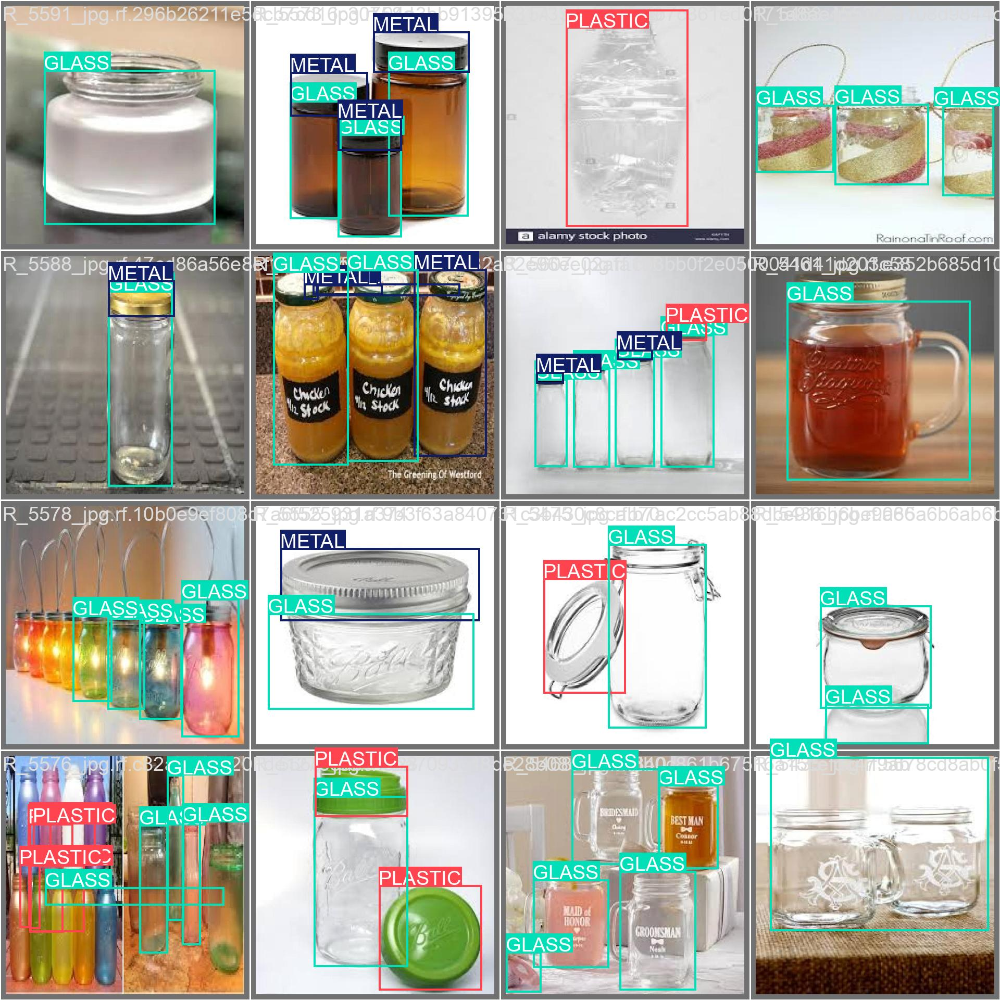
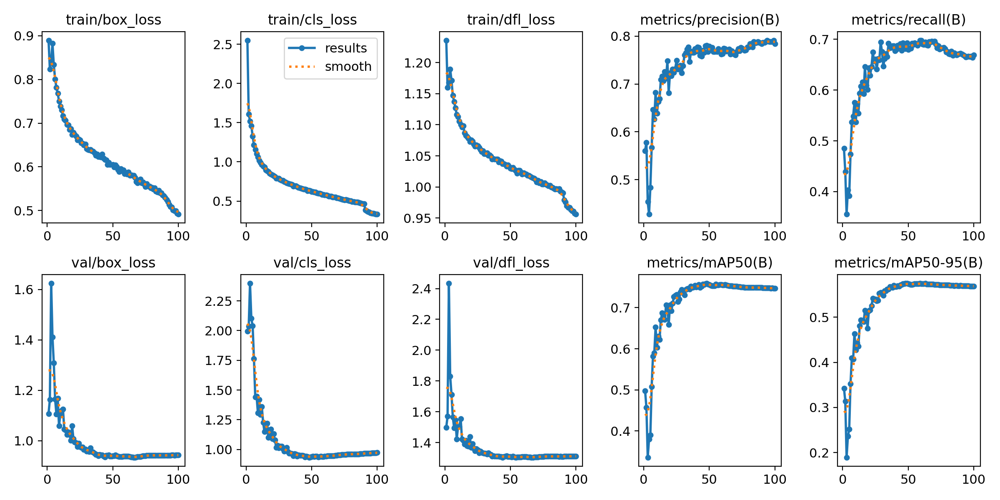
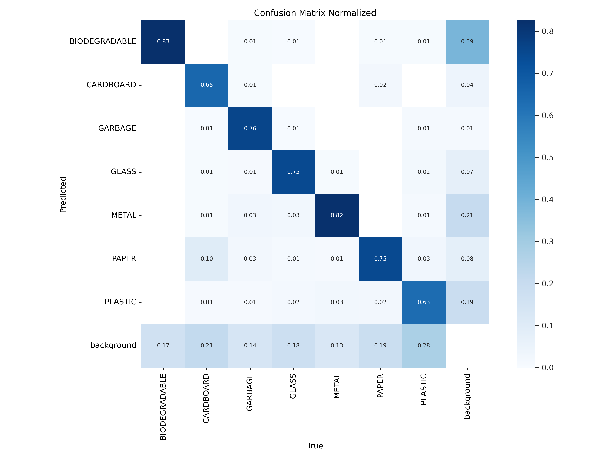
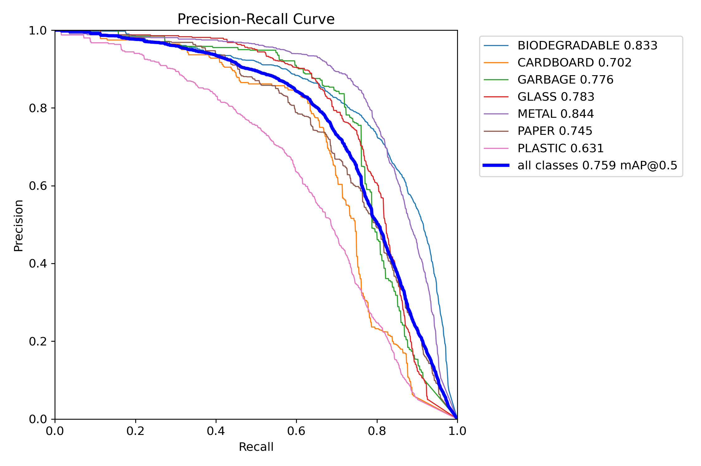
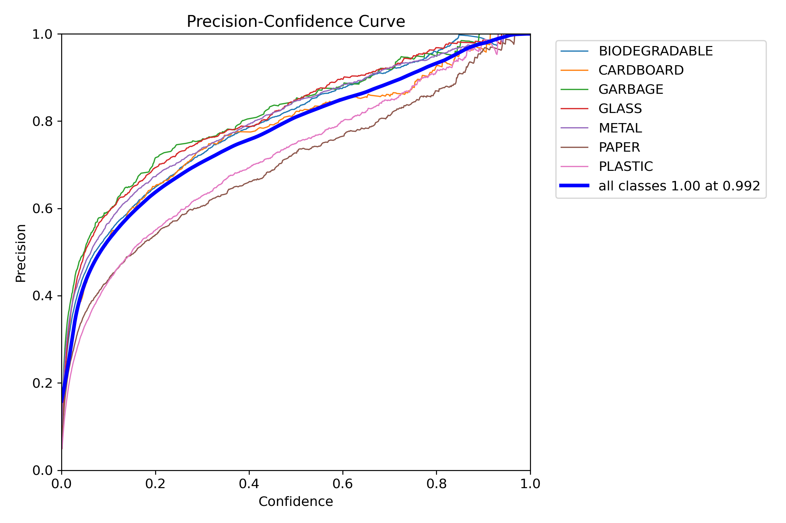
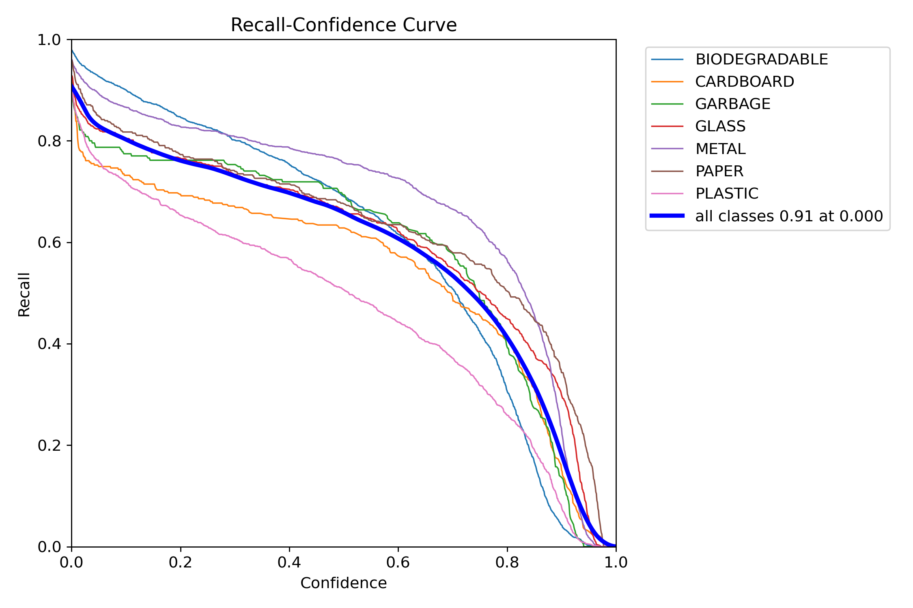
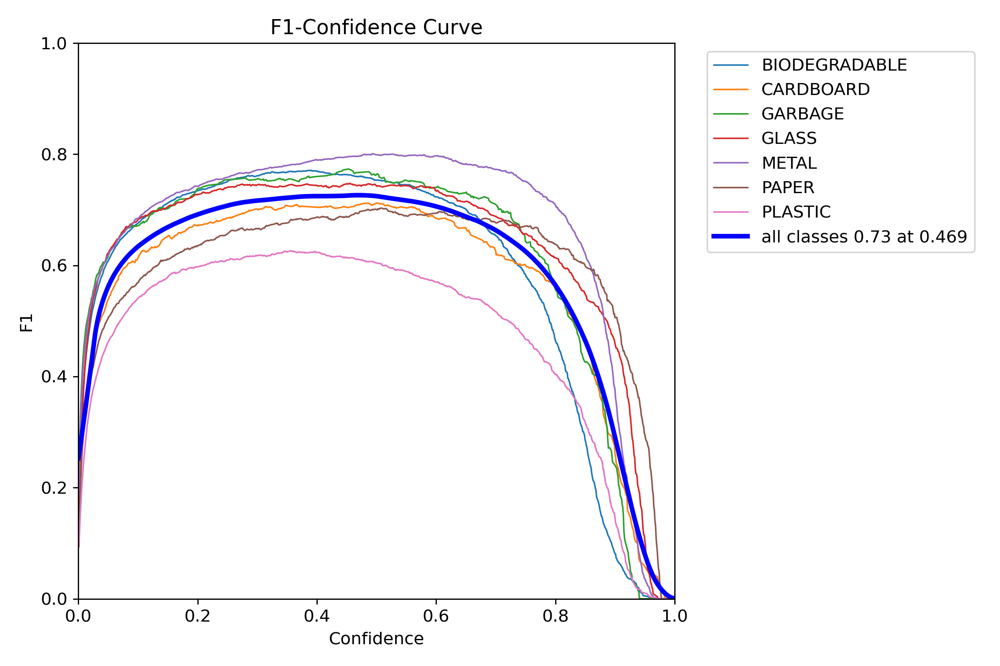

# Waste Classification System using YOLO and Arduino

This project implements a waste classification system that uses a custom YOLO model for detecting and categorizing waste materials. It integrates with an Arduino to communicate the classification results.

## Table of Contents

- [Features](#features)
- [Requirements](#requirements)
- [Installation](#installation)
- [Usage](#usage)
- [Results](#results)
- [Output Images](#output-images)
- [Contributing](#contributing)
- [License](#license)

## Features

- Real-time waste classification using a webcam and YOLO model.
- Categorizes items into burnable and non-burnable waste.
- Sends classification results to an Arduino for further processing.
- Web interface for streaming video and viewing detection results.

## Requirements

- Python 3.8 or higher
- See `requirements.txt` for a complete list of dependencies.

## Installation

1. Clone the repository:
   ```bash
   git clone https://github.com/Afnanksalal/customyolowastesorting.git
   cd repository-name
   ```

2. Create a virtual environment (optional but recommended):
   ```bash
   python -m venv venv
   source venv/bin/activate  # On Windows use `venv\Scripts\activate`
   ```

3. Install the required packages:
   ```bash
   pip install -r requirements.txt
   ```

4. Place your YOLO model file (`best.pt`) in the project directory.

## Usage

1. Connect your Arduino to the computer and ensure the correct COM port is set in the code.
2. Run the FastAPI application:
   ```bash
   python main.py
   ```

3. Open your web browser and go to `http://localhost:8000` to access the web interface.

4. The webcam feed will display detected waste items, and the classification status will be sent to the Arduino.

## Output



## Results


*Result*


*Normalized Confusion Matrix*


*Normalized Confusion Matrix*


*PR Curve*


*P Curve*


*R Curve*


*F1 Curve*

## Contributing

Contributions are welcome! Please open an issue or submit a pull request for any enhancements or bug fixes.

## License

This project is licensed under the MIT License. See the [LICENSE](LICENSE) file for details.
